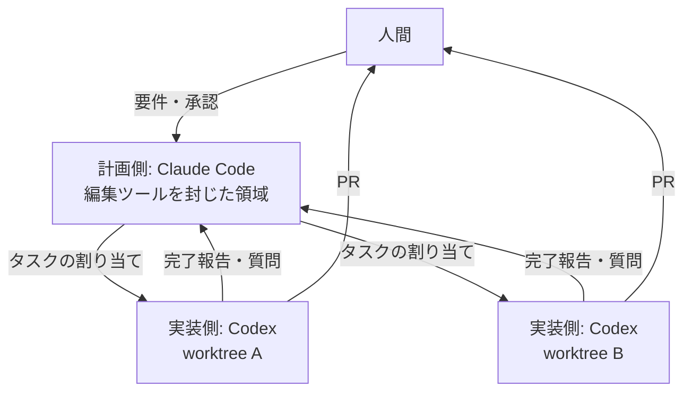

:::message
この記事は筆者の運用と実測をもとに、Claude Code に下書きさせて仕上げたものです。内容は執筆時点（2026年8月、Orca v1.4.177）のもので、Orca は開発が速く CLI は変わりうる。
:::

計画は Claude Code、実装は Codex。エージェントごとに git worktree を分けて並列で走らせ、受け渡しは [Orca](https://github.com/stablyai/orca) に任せる。

いまはこの構成に落ち着いている。何をどう組んでいて、なぜそうしたのかを書く。

## TL;DR

- **計画は Claude Code、実装は Codex**。得意が逆なので役割で固定する
- **エージェントごとに git worktree**。作業場所が混ざらない
- **受け渡しは Orca が最強**。仕事が「割り当て」として残るので、どこで止まったかが分かる
- **計画側からは編集ツールを取り上げる**。すべての変更が PR を通るようになる
- タスク1本あたりは遅くなるが、**品質が上がり、遅さは並列数で取り戻す**
- Orca は無料・MIT ライセンス。自分のエージェント契約をそのまま持ち込める

## 全体像



| | 計画側 | 実装側 |
|---|---|---|
| エージェント | Claude Code | Codex |
| 担当 | 計画・タスク分解・割り当て・判断・完了確認・マージ | 実装・テスト・動作確認・レビュー |
| 作業場所 | メインのチェックアウト | worktree（タスクごとに1本） |
| リポ内ファイルの編集 | **できない（hook でブロック）** | する |

## なぜ Claude と Codex を分けるのか

個人で複数のリポジトリを持っていると、待ち時間が積み上がる。1台のエージェントに投げると終わるまで手が空く。投げたら次を投げたい、が出発点だった。

Claude と Codex を分けたのは、得意が逆だからだ。Claude は発散的で、探索・代替案出し・曖昧な要件の構造化が得意な反面、仕様の隙間を「意図」で埋めにいく。Codex は収束的で、書いてあるとおりに実行する反面、曖昧さを補完しない。だから計画は Claude、実装は Codex に固定した（現行モデルでの観測であって、不変の性質ではない）。

同じディレクトリを2つのエージェントが編集すれば壊れるので、git worktree でそれぞれに別のチェックアウトを与える。そして分けた瞬間、**お互いが見えなくなる**。計画側は進捗が分からない。実装側は迷っても聞けない。人間が両方の画面を行き来してコピペで運ぶことになる。

だから連絡手段が要る。ここが一番難しかった。

## 受け渡しに Orca を選んだ理由

エージェント同士の連絡には、素朴な方法から順に選択肢がある。

**人間が運ぶ。** 片方の出力をコピーして貼る。2台までなら成立するが、3台を超えると人間が一番遅い部品になる。

**ファイルを置く。** 共有ディレクトリに指示を書く。履歴は残るが、エージェントは自発的にファイルを監視しないので、読ませるには結局起こす必要がある。

**端末に文字を打ち込む。** tmux なら他のペインへ直接送れる。

```bash
tmux send-keys -t <ペイン指定> "レビューを開始して" Enter
```

待機中の相手でも動かせるが、入力待ちでないと成立しない。作業中に送れば入力が混ざるし、確認ダイアログが出ていればそれへの返答になる。記録も残らない。

**Claude Code の標準機能を使う。** v2.1.224 から、セッション同士でメッセージを送れる。別のセッションを一覧して名前を指定するだけで、追加インストールは要らない。

一覧するとこうなる（実際の出力の抜粋。リポ名は伏せている）。

```
Peer sessions (8):
  app-a-34 [bdc112]   ·  interactive  ·  idle   ·  started 18h ago
  app-b-08 [5fac33]   ·  interactive  ·  idle   ·  started 9h ago
  app-c-d8 [c19a58]   ·  interactive  ·  shell  ·  started 18h ago
  ...
```

待機中のセッションも、受け取れば起きて処理して返す。手軽さでは一番なので、**まず試すならここから**でいい。ただし受領確認も再送もないので、送ったあと相手が動いているかは分からない。相談には十分だが、仕事の委任には足りなかった。

### どの方法でもぶつかる壁

これらを試して分かったのは、人間同士ならほぼ同時に起きる4つが、エージェント同士では**全部ずれる**ということだった。

| 事実 | ずれる例 |
|---|---|
| 送った | 送信コマンドは成功している |
| 届いた | 相手は確認ダイアログの手前で止まっていて、まだ読んでいない |
| 始まった | 届いた「了解しました」は、1つ前のメッセージへの返事だった |
| 終わった | 報告も状態表示も「成功」なのに、欠陥は残っていた |

しかもどの段でずれても、手前までは成功して見える。**画面の情報だけでは、どこで止まっているか分からない。** ルールを増やしても効かない。確認する手段がなければ、確認できない。

この4つを全部見えるようにしてくれたのが Orca だった。ここから先が本題になる。

## Orca が最強だった

[Orca](https://github.com/stablyai/orca) は Stably AI が作っている、複数のコーディングエージェントを並列で動かすデスクトップアプリだ。MIT ライセンスの OSS で、執筆時点 GitHub 40.4k stars。

```bash
brew install --cask stablyai/orca/orca
```

エージェントごとに実際の git worktree を切り、端末・エディタ・ブラウザを与えて1画面にまとめる。**Orca 自体は無料**で、各エージェントの契約をそのまま持ち込む。

### 仕事が「割り当て」として残る

ここまでの方法は全部「メッセージを送る」しかしない。Orca は状態を持つ**割り当て**として渡す。タスク（何をしてほしいか）、ディスパッチ（どの端末の誰に渡したか）、完了報告（どう終わったか）が記録される。

メッセージは送ったら終わりだが、割り当ては残る。**誰が何を持っていて、いまどの段階かを後から見られる。** 4つの事実がずれても、どこでずれたかを追える。

### worktree を1本増やす手間がゼロになる

worktree 作成・エージェント起動・タスク投入が1本に繋がっている。

```bash
orca orchestration task-create --spec "..." --task-title "..." --json

orca orchestration worker-start \
  --task <task_id> \
  --worktree new-top-level \
  --repo id:<repo_id> \
  --agent codex \
  --json
```

これだけで worktree が切られ、Codex が立ち上がり、タスクが渡る。手間を並べると差が分かる。

| やること | 素朴な方法 | Orca |
|---|---|---|
| worktree 作成 | `git worktree add` | `orca worktree create` |
| エージェント起動 | 別のターミナルで手動 | 同じコマンドで同時に |
| 宛先の登録 | 仕組みによっては必要 | 不要（端末そのものが宛先） |
| 配送の設定 | worktree ごとに必要 | 不要（パソコン全体で1か所） |
| 待機中の相手への送信 | 届かない。tmux でつつく | 届く |
| 撤収 | 登録解除 + worktree 削除 | `orca worktree rm` |

**消えている行が本質**だ。1本増やす手間がゼロに近づいたので、作業場所を分ける運用が現実的になった。実測では、タスク投入から完了報告の受領まで19秒だった。

### 「何で止まっているか」が返ってくる

一番効いたのがこれだ。

```bash
orca terminal wait --terminal <handle> --for tui-idle --json
```

返ってくるのは止まっている理由だ。更新の確認待ち・入力の確認待ち・作業場所の信頼確認など、種類が分かれる。「返事がない」と「更新ダイアログの手前で止まっている」を区別できる。前者は待てばいいが、後者は永久に進まない。

`orca worktree ps` を使えば、どの worktree で誰が生きていて画面に何が出ているかを横断で見られる。未読の印も付くので、放置している相手に気づける。

この横断はリポジトリをまたぐ。自分の環境では17のリポジトリ・19の端末が1つの一覧に載っていて、**別のリポジトリで動いているエージェントにも同じコマンドで連絡できる**。リポジトリごとに連絡の仕組みを立てる必要がない。

### 取りこぼさない・止まる・渡し直す

**受け取ったメッセージは処理するまで消えない。** 受領確認を返すまで再送される。

**差し戻しは新しいタスクとして渡す。** 完了報告を出した相手に話しかけても届かないので、会話の続きではなく割り当てをもう一度やる。

**判断が要るときは止まる。** 実装側から質問を投げて答えを待つ経路がある。計画側にも仕事を止めて決裁を待たせる仕組みがあり、マージやデプロイの手前に置いている。

### 動作確認まで worktree の中で完結する

Orca は端末だけでなく、**エージェントが触れる周辺環境**を一式持っている。

- **埋め込みブラウザ**: エージェントがタブを開いて操作できる。Web アプリの動作確認をそのまま任せられる
- **デスクトップ操作**: 画面上のアプリをアクセシビリティ経由で読んで、クリック・入力できる
- **iOS シミュレータ / Android エミュレータ**: タップ・入力・回転・ログ取得まで CLI から叩ける
- **定期実行**: スケジュールで動くジョブを登録できる
- **GitHub / Linear 連携**: PR やチケットから worktree を開き、文脈をエージェントに渡せる

実装したものを人間が確認しに行く必要が減る。「動かして確かめる」までを worktree の中に閉じられるのは大きい。

### エージェントを選ばない

Claude Code でも Codex でも、ターミナルで動くものなら概ね載る。契約は自分のものをそのまま使うので、**Orca のために追加で払うものがない**。乗り換えコストが実質ないので、エージェントの流行が変わっても土台は残る。

スマホから状況を見て指示を送ることもできる（自分はまだ使っていない）。

## 計画側には編集させない

これはメッセージの話と地続きだ。計画するエージェントは、放っておくと自分で直し始める。「ついでにこれも直すか」でメインの作業ディレクトリを編集する。

その編集は実装側の worktree に存在しない。前提がずれて、成果物を取り込んだ瞬間に衝突するか静かに上書きされる。**そもそも連絡が要らなくなる**ので、受け渡しの仕組みが素通りされる。

「編集しない」とルールに書いても守られなかった。お願いベースのルールは守られたり守られなかったりする。なので Claude Code の hook を1本置いて、計画側がメインの作業ディレクトリを編集しようとしたら機械的に断るようにした。

断るときに代わりの手段（「実装側へ渡せ」）を書いておくのが肝だった。ただ拒否すると、別の書き込み方法を探しに行く。

計画側が編集できなければ、すべての変更が実装側の worktree を通り、PR にまとまる。

## 速くはならない。でもコードは良くなった

正直に書くと、**タスク1本が終わるまでの時間はむしろ延びた**。

仕様を書き、送り、動き出したのを確認し、待ち、完了報告を受け、実体を確認する。自分のセッションで直せば30秒で終わることも、委任すると数分かかる。受け渡しのぶんだけ確実に遅い。

代わりに、コードの質は上がった。狙ってやったわけではなく、構造上そうなった。

- **すべての変更が PR を通る**。計画側が直接編集できないので、差分が必ず一度は形になる。「気づいたら main が変わっていた」が起きない
- **「ついで修正」が混ざらない**。worktree が別なので、1タスク1ブランチが自然に守られる。差分が小さいままなので、レビューが効く
- **レビューが独立する**。仕様を書いた側と実装した側が別のエージェントなので、意図で埋めた隙間が実装の段階で露見する。同じセッションが書いて自分でレビューすると、この検出は起きない
- **完了が報告で済まない**。「終わりました」を実体と突き合わせる手順が固定化されるので、思い込みで次へ進まなくなった

そして遅さは台数で取り戻せる。1本が遅くなっても、3本同時に走っていれば合計では速い。**1本の速さを捨てて、並列数と品質を買っている**という感覚が近い。

## まとめ

**連絡手段は素朴な方法から順に選べる**

| 方法 | 向いている場面 | 限界 |
|---|---|---|
| 人間がコピペ | 2台まで | 人間が一番遅い部品になる |
| ファイルを置く | 履歴を残したい | 相手が読みに来ない |
| tmux で打ち込む | 待機中の相手を動かしたい | 入力待ちでないと壊れる |
| Claude Code のセッション間メッセージ | 手軽に始めたい | 受領確認と再送がない |
| Orca | 仕事を委任して結果を待ちたい | デスクトップアプリが要る |

**Orca が解決したこと**

- 仕事が割り当てとして残るので、誰が何を持っていて、どこで止まったかが分かる
- 止まっている理由が種類つきで返る。受領確認があるので取りこぼさない
- worktree 作成・エージェント起動・タスク投入が1コマンド。リポジトリをまたいでも届く
- 動作確認用のブラウザ・エミュレータ込みで、無料・MIT・自分の契約をそのまま使える

**代償と見返り**

- タスク1本あたりの時間は延びる。受け渡しのぶんだけ確実に遅い
- 代わりに全変更が PR を通り、レビューが独立するのでコードの質は上がる
- 遅さは並列数で取り戻す。1本の速さを捨てて、台数と品質を買っている

無料で、乗り換えコストもない。並列で AI に書かせているなら、**受け渡しは Orca が最強**だと思う。
